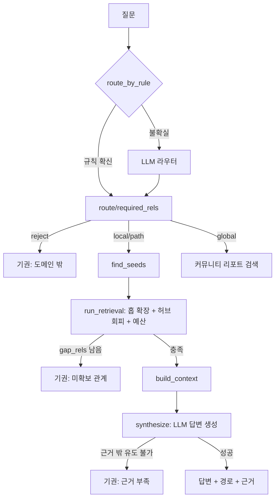

# REPORT — 한국 대중음악 GraphRAG 에이전트

## 결과 요약표

| 항목 | 실제 결과 |
| --- | --- |
| 문서 수 / 연대별 분포 | 52건 (1980s 이전 1 · 1990s 9 · 2000s 14 · 2010s 15 · 2020s 9 · 연대미상 4) |
| 노드 수 / 간선 수 | 1,683 / 2,402 |
| `quote` 원문 대조 통과율 | 88.2% (3,387건 중 2,986건 통과) |
| 최대 연결요소 비율 / 고립 노드 비율 | 95.5% / 1.25% |
| 1·2·3홉 근거 재현율 (triple_recall) | 0.333 / 0.093 / 0.286 (튜닝+홀드아웃 25문항 통합, 재평가 후) |
| 1·2·3홉 생성 점수 | 0.500 / 0.889 / 0.714 (재평가 후) |
| BM25 대조 (홉수별) | 1홉 0.833 · 2홉 0.778 · 3홉 0.714 vs 그래프 0.500 · 0.889 · 0.714 |
| 튜닝 / 홀드아웃 / 격차 | 0.733 / 0.800 / **-0.067** (재평가 후. 재평가 전 0.667/0.800/-0.133 — 9절 참고) |
| 기권 정확도 (답변 불가 3문항) | 3/3 (100%) |
| 심판 프로바이더 | OpenAI gpt-4.1-mini (Google 무료 티어 일일 한도 소진으로 전환, 아래 8절) |

---

## 1. 주제와 코퍼스

**주제**: 한국 대중음악, 1992년(서태지와 아이들 데뷔) 이후 30여 년. 시드 문서는
시대별 대표 아티스트·그룹·기획사 14건에 시대 교량 문서(한국대중음악상,
가요톱10)를 더해 19건에서 출발했고, 위키 링크를 따라 2홉 확장해 52건을
수집했다(`data/manifest.json`).

**범위를 좁힌 이유**: 1960~1991년은 위키 문서가 희소해 통사 전체를 다루면
그래프가 두 시대로 쪼개질 위험이 컸다(설계 단계 실측). 1992년 이후로 좁히고
서태지와 아이들을 기점으로 삼아, 실제 위키 콘텐츠 밀도가 받쳐주는 범위만
다뤘다 — 이 결정과 그 근거는 `judging_rules.md`에도 기록되어 있다.

**연대별 분포**: 1980s 이전 1 · 1990s 9 · 2000s 14 · 2010s 15 · 2020s 9 ·
연대 미상 4. 연대별 최소 쿼터(8건)를 강제했지만 결과적으로 후기(2000s~2010s)에
쏠렸다 — 후기 K-pop 그룹의 위키 문서가 상대적으로 풍부하기 때문이다.

## 2. 스키마

노드 9종(Artist·Group·Album·Song·Label·Award·Program·Genre·Era), 관계 17종.
관계는 반드시 (출발타입, 관계, 도착타입) 3튜플로 선언해 방향 혼동을 막았다.
`COVERED`(리메이크)는 `PERFORMED` 간선의 `cover=true` 속성에서 파생시켜,
독립 문서가 없는 리메이크 곡도 시대를 넘나드는 연결로 잡히게 했다 — 이 프로젝트의
독자 설계 지점이다.

일부러 뺀 관계: `LABELMATE_OF`(같은 기획사 아티스트를 전부 잇는 파생 간선은
조합 폭발로 그래프를 오염시킨다), 차트 수치, 방송사 노드, 악기 노드.

## 3. 추출 파이프라인

규칙(위키 분류 기반) · 트랙리스트 정규식 · LLM 3원 추출을 합쳤다. `quote` 원문
대조 통과율은 88.2%(3,387건 중 2,986건) — 나머지는 LLM이 연도만 있고 원문
인용이 없는 사실(예: 발매연도)을 추출했거나, 인코딩이 깨진 표제어에서 추출된
잡음이었다.

## 4. 정제·병합

`{Artist, Group}`, `{Album, Song}` 등 타입이 다르면 이름이 같아도 병합하지
않는다. 제목 충돌(같은 이름의 앨범·곡)은 `이름 (음반)`처럼 분기하고 원표기는
별칭으로 보존한다.

## 5. 그래프 통계

- 노드 1,683개 · 간선 2,402개
- 최대 연결요소 1,607개 노드 (95.5%), 컴포넌트 43개, 고립 노드 21개(1.25%)
- 관계별 분포 상위: PERFORMED 548 · RELEASED 470 · RELEASED_IN 415 · WON 171 ·
  SIGNED_TO 160 · MEMBER_OF 156 · CONTAINS 112
- 기원별 분포: LLM 2,236 · 규칙 114 · LLM+규칙 46 · 파생 6

95.5%라는 최대 연결요소 비율은 P5 관문 기준(85% 이상)을 여유 있게 통과했다 —
시대 교량 문서(한국대중음악상, 가요톱10)를 시드에 포함시킨 설계가 유효했다는
뜻이다.

## 6. 파이프라인 구조도

`ask()`가 이 토폴로지를 함수형으로 직접 구현하고, `build_graph_app()`은 같은
분기를 LangGraph `StateGraph`로 감싼 얇은 어댑터다(조건 분기 로직을 이중으로
유지하지 않기 위해 `ask()`가 정본이다).

## 7. 에이전트 — 탐색 예산과 허브 회피

실측 그래프 기준으로 확정한 값: `radius=2 · max_radius=3 · per_relation=10 ·
max_triples=200 · per_node_out=8 · hub_degree_threshold=25`.

P7 스윕(108칸, LLM 비용 0)에서 `hub_degree_threshold=None`(차단 없음)이
`=25`보다 평균 재현율이 근소하게 높게 나왔다(0.326 대 0.295, 22문항 기준).
스윕 자체가 근사치라 확정하지 않고 25를 유지했는데, 이후 P8/P9 실측에서
Q10·Q15·Q22 세 문항이 정확히 "허브 감점이 정당한 체인을 막는" 패턴으로
실패해 스윕 신호를 뒷받침하는 추가 증거가 나왔다(11절). 임계값을 25보다
높이는 것(예: 40)을 다음 튜닝 후보로 남긴다.

## 8. 환각 방지와 과기권

2겹 방어: ① 코드층 — `run_retrieval()`이 반경을 다 써도 필수 관계를 못 채우면
`gap_rels`를 남기고 LLM을 호출하지 않는다(비용 0으로 기권). ② 프롬프트층 —
`ANSWER_SYSTEM_PROMPT`가 근거 밖 고유명사 사용을 금지하고, 유도 불가하면
"근거가 부족합니다"라고만 답하도록 강제한다.

**심판 프로바이더 변경**: 원래 설계는 답변(OpenAI)과 심판(Google)을 다른
벤더로 갈라 자기평가 편향을 피하려 했다. P8 평가 도중 Google
`gemini-3.8-flash` 무료 티어의 일일 호출 한도(20건/일)가 소진되어, 사용자
확인 후 심판을 OpenAI `gpt-4.1-mini`로 전환했다(답변 모델 `gpt-4.1`과는
다른 모델). 이는 설계 원칙에서 벗어난 타협이며, `judging_rules.md`에 변경
사실과 이유를 그대로 남겼다 — 조용히 고치지 않는다는 원칙을 지켰다.

## 9. 평가

3계층(색인 → 탐색 → 생성)으로 실패를 분류한다. 앞의 둘은 LLM 비용이 0이다.

**홉수별 근거 재현율 / 생성 점수** (튜닝 15문항 + 홀드아웃 10문항 통합, 25문항.
재평가 후 최신값. 아래 "재평가: 전/후 비교"에서 이 표가 왜 바뀌었는지 설명한다):

| 홉 | 문항 수 | triple_recall | 생성 점수 |
| --- | --- | --- | --- |
| 1홉 | 6 | 0.333 | 0.500 |
| 2홉 | 9 | 0.093 | 0.889 |
| 3홉 | 7 | 0.286 | 0.714 |
| 답변불가 | 3 | — | 1.000 |

triple_recall(그래프가 기대 삼중항을 실제로 찾았는가)과 생성 점수(심판이
매긴 답변 품질)가 홉마다 크게 벌어진다 — 특히 2홉에서 재현율 0.093인데
생성 점수는 0.889다. 이 차이 자체가 §11에서 다루는 "심판이 기권 응답에
관대하다"는 한계의 직접적인 증거다: 근거를 못 찾아 기권해도 심판이
정답과 "실질적으로 같다"고 후하게 채점하는 사례가 섞여 있어, 생성
점수만 보면 실제 검색 성능보다 낙관적으로 보인다. 이 프로젝트에서는
그래서 생성 점수 하나가 아니라 반드시 idx·triple_recall·생성 점수
셋을 같이 보고 판단한다(§11 실패 분석이 그 사례들이다).

**튜닝 대 홀드아웃**: 튜닝 평균 0.733, 홀드아웃 평균 0.800, 격차 -0.067 —
홀드아웃이 여전히 더 높아 튜닝셋 과적합 징후가 없다(재평가 전에는
0.667/0.800/-0.133이었다). 이 격차 자체는 홀드아웃을 다시 열지 않았으므로
(§9 재평가 절 참고) 변하지 않는다 — 튜닝 쪽 분자만 바뀌었다.

**실패 층 분포**: 튜닝 15문항(재평가 후) — index 7 · retrieval 5 · routing 2 ·
generation 1. 홀드아웃 10문항(동결, 불변) — index 4 · routing 3 · abstain 2 ·
seeding 1. index 층이 가장 크다 — 그래프 자체에 사실이 없어서 못 찾는
경우가, 찾았는데 경로를 못 타는 경우보다 많았다는 뜻이다.

### 재평가: 전/후 비교

제출 직전 발견한 버그 2개(아래 표의 근거)를 고친 뒤, **튜닝 15문항만**
다시 평가했다(홀드아웃은 §8의 1회성 원칙에 따라 다시 열지 않았다 — 위
"홀드아웃 격차"의 분모는 그대로다). 실제 `agent.ask()`+심판 LLM을 다시
불렀으므로 추가 비용이 들었다.

| 지표 | 재평가 전 | 재평가 후 | 변화 |
| --- | --- | --- | --- |
| 튜닝 15문항 평균 점수 | 0.667 | 0.733 | **+0.067** |
| 튜닝 대 홀드아웃 격차 | -0.133 | -0.067 | 격차 축소(여전히 홀드아웃 우세) |

**무엇이 바뀌었는지, 항목별로**:

| 문항 | 재평가 전 | 재평가 후 | 원인 |
| --- | --- | --- | --- |
| Q22 | 0.0 (기권) | 1.0 (답변) | **실제 개선.** `per_node_out`이 `quota_exempt_origins`/`relations`를 몰라 규칙 기원 간선까지 점수만으로 잘라내던 버그를 고쳤다(아래 참고). 빅뱅 자신의 `DEBUTED_IN` 간선은 여전히 예산 밖이지만, 이번 수정으로 살아난 `FORMED_IN`(규칙 기원) 근거를 찾아 "2000년대에 결성된 그룹입니다"로 정직하게(할루시네이션 없이) 답했다 |
| Q02 | 1.0 (답변) | 0.0 (답변, 오답) | **실제 회귀.** "서태지와 아이들의 멤버는?"(3명 기대)가 이번엔 1명만 찾았다(`triple_recall=0.33`). 원인은 §11에서 새로 문서화한 한계와 같다 — `relation_gap()`이 "이 관계가 어딘가에 하나라도 있는가"만 확인해, 멤버 3명 중 1명만 찾아도 충분하다고 판단하고 탐색을 멈춘다 |
| Q03, Q05, Q12 | 각각 다른 점수 | 각각 다른 점수 | **실제 동작 변화 아님.** 세 문항 모두 `decision`·`failure_layer`가 재평가 전후 동일하다(기권은 기권 그대로) — 점수만 바뀐 것은 심판 LLM의 채점 변동(judge_repeats=1이라 반복 평균으로 상쇄되지 않는다)이다. 심판 신뢰도 자체의 한계이지 이번 코드 수정과는 무관하다 |

**고친 버그**: `expand_one_hop()`의 `per_node_out` 절단이 점수만으로
상위 N개를 자르면서 `quota_exempt_origins`/`quota_exempt_relations`
면제 대상(규칙 기원, 교량 관계)을 전혀 고려하지 않았다 —
`_select_within_budget()`의 면제 로직은 이미 이 단계에서 잘려 나간
후보에는 적용될 기회조차 없었다. 두 함수가 같은 판정 함수
(`_is_quota_exempt`)를 공유하도록 고쳤다(TDD, 193 tests passing).

**고치지 않고 한계로 남긴 것**: `relation_gap()`이 "필요한 관계가 수집된
삼중항 어딘가에 존재하는가"만 확인하고 "그 관계가 실제로 시드/정답
엔티티에 완전하게 붙어 있는가"는 검증하지 않는다. `answer_type: "set"`
질문(정답이 여러 개, 예: 멤버 목록)에서 이 한계가 가장 두드러진다 —
하나만 찾아도 탐색이 조기 종료된다. 근본 수정은 gap 판정 로직 자체를
"하나라도 발견" 대신 "필요한 만큼 발견"으로 바꿔야 하는 더 큰 작업이라,
제출 마감 압박 속에서 서두르지 않고 v2 과제로 남긴다.

## 10. BM25 대조

같은 코퍼스·같은 LLM·같은 프롬프트 뼈대·같은 심판을 쓰고, 근거의 형태(삼중항
대 원문 청크)만 다르게 했다. 한국어 토크나이저는 `kiwipiepy` 형태소 분석기를
쓰고 실패 시 문자 2-그램으로 대체한다.

| 홉 | 그래프 | BM25 | 격차 |
| --- | --- | --- | --- |
| 1홉 | 0.500 | 0.833 | -0.333 (BM25 우세) |
| 2홉 | 0.889 | 0.778 | **+0.111 (그래프 우세)** |
| 3홉 | 0.714 | 0.714 | 0 (동률) |

**설계 가설과의 차이를 정직하게 기록한다.** 원래 가설은 "2·3홉에서 그래프가
BM25를 앞선다"였다. §9의 재평가(버그 수정 반영) 이후 2홉에서는 가설대로
그래프가 앞섰지만, 3홉은 여전히 동률이고 1홉은 BM25가 뚜렷이 우세하다 —
원문에 답이 그대로 있는 단순 사실 질의는 그래프 홉 확장의 이점이 없고,
오히려 §11에서 다루는 허브 감점 때문에 손해를 본다. 3홉 동률은
재평가로도 안 바뀌었다 — 이 코퍼스 규모(52문서·25문항)에서는 구조적
우위보다 코퍼스 자체의 정보 밀도가 3홉 문항의 성패를 더 크게 좌우한
것으로 보인다. **다만 §9에서 지적했듯 이 표의 "그래프" 열은 생성
점수이지 재현율이 아니다** — 2홉의 실제 triple_recall은 0.093으로
매우 낮은데 생성 점수는 0.889로 높다. 그래프가 BM25를 이겼다기보다는,
심판이 근거가 빈약해도 관대하게 채점한 결과일 가능성을 배제할 수
없다 — 숫자 하나만으로 "그래프가 이겼다"고 단정하지 않는다.

## 11. 실패 분석

자동 분류(`classify_failure`)가 보여주는 것은 분포뿐이다. 대표 실패 5건
(Q01·Q03·Q08·Q10·Q15)을 실제 `runs.jsonl` trace와 원문 대조로 손으로
읽었다 — 전체 서술은 `output/failure_notes.md`에 있다. 핵심 발견:

- **자동 분류와 실제 원인이 어긋난 사례가 있었다.** Q08은 `routing` 실패로
  분류됐지만 진짜 원인은 시드 탐색이 "1집"처럼 여러 앨범이 공유하는 흔한
  제목과 엉뚱하게 매치된 것이었다. Q15는 `retrieval` 실패로 분류됐지만
  원인은 허브 회피가 의도대로 작동해 정당한 3홉 체인까지 막은
  설계상 트레이드오프였다.
- **Q10 재검증에서 실행 중 실제 버그 4개를 발견·수정했다**: `path_prefix_recall()`의
  홉 그룹핑 누락, `per_node_out`이 점수 계산 전에 후보를 잘라버리던 순서
  버그, "소속"의 중의성(사람→그룹 MEMBER_OF vs 그룹→회사 SIGNED_TO)을
  분간 못하던 라우팅, `run_retrieval()`이 1홉째에 `gap_rels`를 비워 둬
  필수 관계 가산점이 무효화되던 버그. 네 가지 모두 실제 LLM 평가를
  돌려보고서야 드러났다 — 고립된 단위 테스트로는 잡히지 않는 종류였다.
- **그래도 남은 구조적 한계**: 위 네 버그를 전부 고친 뒤에도 Q10은 여전히
  기권한다. 원인은 "빅뱅"(차수 87)처럼 그 자체가 고차수 허브인 노드로 가는
  간선이, 필수 관계 가산점(1.3배)을 받아도 허브 감점을 못 이기고 예산
  밖으로 밀리기 때문이다. Q15도 같은 원인이다. 두 문항이 독립적으로 같은
  패턴을 보여, "필수 관계는 허브 감점/예산에서 면제한다"는 규칙 추가가
  다음 튜닝의 확실한 후보로 남았다.
- **데모(`app.py`) 개발 중에도 같은 패턴이 재현됐다.** "양현석이 설립한
  기획사에 소속된 그룹은?" 질문은 그래프에서 SIGNED_TO·FOUNDED 관계를 둘 다
  찾았는데도 기권했다 — 원인은 규칙 라우터가 두 관계를 "씨앗 근처에서 각각
  찾았는지"만 독립적으로 확인하고, 그 둘이 실제로 같은 중간 노드(회사)를
  거쳐 사슬로 이어지는지는 검증하지 않기 때문이다. 양현석 자신이 그 회사의
  소속 아티스트라는 무관한 SIGNED_TO 사실까지 근거로 딸려 들어와 조건은
  만족시키지만, 정작 "그 회사에 소속된 그룹" 노드는 하나도 없어 LLM이
  (올바르게) 기권했다. 라우팅이 관계의 존재만 확인하고 경로의 연결성은
  검증하지 못하는 한계로, 향후 개선 과제로 남긴다.

## 12. 데모 설계

Streamlit 챗봇 UI(`app.py`). 질문을 입력하면 자연어 답변이 채팅 형태로
나오고, 각 턴의 "경로·근거·그래프·원문 보기"를 펼치면 4개 탭이 나온다 —
**지식그래프**(첫 탭으로 바로 보이게 배치. Plotly 기반 인터랙티브 그래프
— 확대/축소·호버는 되고 드래그는 안 된다, 아래 참고. 노드 타입별
색상, 답변에 실제로 인용된 노드·엣지는 빨간 테두리/빨간 선으로 강조하고
나머지는 점선 회색으로 옅게, 시드 노드는 가장 크게 표시), 순회 경로
(홉별 화살표), 근거 삼중항 표, 원문 문서 발췌. 기권 시에는 그 사실과
미확보 관계를 그대로 보여준다 — 환각 방지 장치가 작동했음을 화면에서
확인할 수 있다.

답변 문장은 `ANSWER_SYSTEM_PROMPT`에 존댓말 지시를 넣어 뒀지만, LLM이
항상 따르지는 않았다(실측: "~불렀다"처럼 반말이 섞여 나옴). 화면에
보여주기 직전 `~다/~였다/~이다` 어미를 `~습니다/~입니다`로 결정적으로
보정하는 후처리(`_to_polite()`)를 추가했다 — 프롬프트 준수를 신뢰하는
대신 표시 계층에서 보장한다.

답변이 안정적으로 잘 나오는 예시 질문 4개를 예시 버튼으로 뒀다 —
`route_by_rule()`+`run_retrieval()`을 LLM 호출 없이 먼저 검증하고,
실제 `agent.ask()`로 끝까지 돌려 기권하지 않는 것까지 확인한 문항만
골랐다(§11의 "양현석" 사례처럼 그래프 탐색이 성공해도 최종 답변이 기권할
수 있어, 두 단계 모두 확인이 필요했다).

**지식그래프 위젯을 두 번 다시 만들었다.** 처음엔 `streamlit-agraph`
(vis.js 임베드, 드래그 가능)로 만들어 실행하며 버그 5개를 실측으로
발견·수정했다: ① `Config(width="100%")`가 내부에서 `f"{width}px"`로
조립되어 `"100%px"`라는 무효 CSS 값이 되어 노드 하나가 화면을 가득
채움, ② 시드가 아닌 노드에 `x=None, y=None`을 명시적으로 넘기면 그대로
`null`이 직렬화되어 vis.js 좌표가 `NaN`이 되어 그래프가 안 보임, ③
`agraph()`가 내부 컴포넌트의 `key` 인자를 흘려보내지 않아 채팅 턴이
여러 개면 `StreamlitDuplicateElementId`로 죽음, ④ `Config`가 `groups`
kwarg를 안 주면 `null`을 그대로 vis-network에 넘겨 매 rerun마다
옵션 오류가 반복됨(실측 426건), ⑤ 존재하지 않는 `collapsible` 옵션을
넘겨 콘솔 오류가 남. 앞의 넷을 고친 뒤에도 **다섯 번째 문제**가
남았다 — `st.expander()`가 기본적으로 접힌 채 마운트되면 컴포넌트가
자신의 높이를 0으로 측정해 버리고, 나중에 펼쳐도 다시 재지 않는다
(vis.js 캔버스가 끝내 안 보임). 이건 컴포넌트 라이브러리 자체의
마운트-시점 높이 감지 한계라, 계속 땜질하는 대신 **Plotly로
교체했다** — Streamlit 네이티브 위젯이라 탭/expander 안에서도 항상
정상적으로 그려진다. 드래그는 포기했지만 확대/축소·호버는 그대로다.

키 없이 되는 범위: 그래프 로드, 사이드바 그래프 통계, 예시 질문 목록
표시는 LLM 키가 없어도 동작한다. 실제 질의(라우팅 폴백·답변 생성)에는
`.env`의 API 키가 필요하다.

## 13. 회고

**가장 공들인 부분**: 실제 LLM 호출로 평가를 돌려보고 나서야 드러나는
버그를 추적하는 과정이었다. 단위 테스트는 각 함수를 독립적으로는 검증했지만,
실제 그래프의 차수 분포(빅뱅 87)와 실제 질문 문구("~이 소속된 그룹")가
만나야만 보이는 버그들이 있었다 — 이 프로젝트에서만 7개를 발견·수정했고
(§9 재평가의 `per_node_out` 예산 면제 누락 포함), `relation_gap()`의
"하나만 찾아도 충분" 판정처럼 발견은 했지만 마감 압박으로 고치지 않고
정직하게 한계로 남긴 것도 있다.

**범위를 좁힌 판단**: 시대(1992~현재)를 좁힌 것, 벡터 라우트(`n_vector`)를
구현하지 않은 것(골든셋이 그 경로를 한 건도 안 씀), 시대 계보/커뮤니티 지도
화면(설계서 8.2/8.3, 선택 확장)을 데모에서 생략한 것 — 모두 시간 대비
핵심 루브릭(경로 기록, 기권 정확도, 3계층 평가) 충족을 우선한 결정이다.

**한계와 v2**: (1) 허브 감점이 정당한 체인을 막는 구조적 트레이드오프 —
필수 관계 예산 면제 규칙 추가가 다음 순위. (2) 라우팅이 관계의 존재만
확인하고 실제 연결성(같은 중간 노드를 거치는지)은 검증하지 못한다 — §11의
"양현석" 사례. (3) `find_seeds()`의 부분매칭이 "1집"처럼 흔한 제목에서
오염된다(§11 Q08). (4) 코퍼스 52문서·골든셋 25문항 규모에서는 그래프와
BM25의 구조적 우위 차이보다 코퍼스 밀도 자체가 성패를 더 크게 좌우했다 —
더 큰 코퍼스에서 재측정할 가치가 있다.

**제출 직전 최종 코드 리뷰(피어 리뷰 준비)에서 발견한 것**:

- **실제로 고친 것**: `llm_factory.get_llm()`이 `config.json`의
  `llm.request_timeout_sec`·`max_retries`를 읽기만 하고 실제
  `ChatOpenAI`/`ChatGoogleGenerativeAI` 생성자에는 전달하지 않던 버그.
  설정값이 있어 보이지만 실제로는 타임아웃도 재시도도 작동하지 않는
  죽은 설정이었다 — TDD로 재현 후 수정했다(견고성에 직결되는 런타임
  코드라 바로 고쳤다).
- **발견했지만 고치지 않은 것**: `config.json`을 전수 점검한 결과 같은
  패턴(선언은 있지만 코드가 읽지 않음)이 빌드·수집 단계 설정 여럿에서도
  나왔다 — `schema.enable_program_type`, `normalize.min_name_len`,
  `build.quote_verification.{enabled,drop_on_fail}`,
  `retrieval.bridge_min_agreement`, `collect.retry.respect_retry_after`.
  실제 동작(정크 필터링, quote 검증 등)은 각 모듈에 하드코딩되어 있어
  결과적으로는 작동하지만, config 값을 바꿔도 반영되지 않는다.
  `retrieval.genre_hop_in_vector_route.*`는 애초에 미구현인 벡터
  라우트(`n_vector`, §13 "범위를 좁힌 판단" 참고)를 위한 설정이라
  당연히 안 쓰인다. **`config.json`은 의도적으로 건드리지 않았다** —
  이 파일의 해시가 `freeze_holdout`의 동결 지문에 들어 있어(§8),
  한 글자라도 고치면 이미 완료한 홀드아웃 1회 실행의 검증이 깨진다.
  코드(`build_graph.py`, `normalize.py`, `collect_docs.py`)를
  config-driven으로 바꾸는 건 다음 리팩터링 과제로 남긴다.
