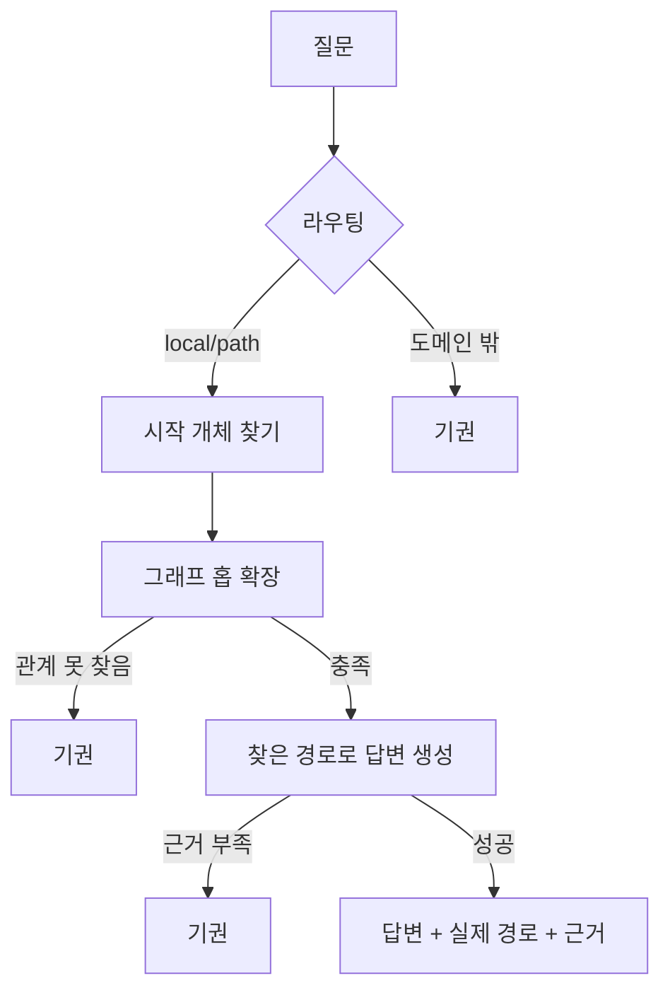

# REPORT — 한국 대중음악 GraphRAG 에이전트

## 이 에이전트는 무엇을 하는가

1992년(서태지와 아이들 데뷔) 이후 한국 대중음악에 대해 질문하면
답하는 에이전트다. "이 그룹의 멤버는?", "A가 세운 회사에 소속된
그룹은?", "이 곡을 리메이크한 가수는?"처럼, **하나의 사실이 아니라
사실과 사실을 관계로 연결해야 답이 나오는 질문**을 다룬다.

일반적인 RAG는 질문과 비슷한 문서 조각을 찾아 그대로 근거로 쓴다.
이 방식은 "A가 세운 회사"와 "그 회사에 소속된 그룹"이 서로 다른
문서에 흩어져 있으면 놓치기 쉽다. 이 프로젝트는 대신 **위키백과로
지식그래프(누가 누구를 만들었고, 어느 회사 소속이고, 어떤 관계인지를
그래프로 저장)를 미리 만들어 두고, 에이전트가 그 그래프를 홉(hop)
단위로 직접 걸어가며 답을 찾는다.** 원문 검색이 아니라 관계 경로
추적이라는 점이 Basic RAG와의 핵심 차이다.

근거를 못 찾으면 없는 사실을 지어내지 않고 기권한다 — 이 프로젝트에서
가장 신경 쓴 부분이다.

## 결과 요약표

| 항목 | 결과 |
| --- | --- |
| 문서 수 / 총 글자 수 | 52건 / 435,633자 (평균 8,377자) |
| 노드 수 / 간선 수 | 1,683 / 2,402 |
| `quote` 원문 대조 통과율 | 88.2% |
| 최대 연결요소 비율 / 고립 노드 비율 | 95.5% / 1.25% |
| 홉별 근거 재현율 (1·2·3홉) | 0.333 / 0.093 / 0.286 |
| 홉별 생성 점수 — GraphRAG | 0.500 / 0.889 / 0.714 |
| 홉별 생성 점수 — Basic RAG(BM25) | 0.833 / 0.778 / 0.714 |
| 튜닝 / 홀드아웃 평균 점수 | 0.733 / 0.800 |
| 기권 정확도 (답변 불가 3문항) | 3/3 |

---

## 1. 코퍼스 — 무슨 말뭉치로 학습했나

한국어 위키백과에서 자동 수집했다. 대표 아티스트·기획사·시상식 시드
18건(서태지와 아이들·H.O.T.·보아·빅뱅·방탄소년단·NewJeans·SM·YG
엔터테인먼트·한국대중음악상 등)에서 출발해 위키 링크를 2홉 따라가며
확장, **총 52건 / 435,633자**를 모았다.

| 연대 | 1980s 이전 | 1990s | 2000s | 2010s | 2020s | 미상* |
| --- | --- | --- | --- | --- | --- | --- |
| 문서 수 | 1 | 9 | 14 | 15 | 9 | 4 |

\* 특정 연대가 아닌 장르 개관/교량 문서(K-pop, 가요톱10 등)

**왜 1992년부터인가**: 그 이전은 위키 문서가 희소해서, 전체를 다루면
그래프가 시대별로 끊긴 섬이 된다는 게 실측으로 확인됐다. 서태지와
아이들을 기점으로, 실제 문서 밀도가 받쳐주는 범위만 다뤘다.

## 2. 어떻게 동작하는가 — 기술 구조

**1단계, 그래프 만들기**: 위키 문서에서 (인물, 관계, 대상) 형태의
사실을 뽑아낸다 — 규칙(위키 분류 기반) · 트랙리스트 정규식 · LLM
3원 추출을 합친다. 노드 9종(Artist·Group·Album·Song·Label·Award 등),
관계 17종. 추출한 사실이 실제 원문에 있는지 대조해 88.2%만 채택한다
(나머지는 원문 근거 없이 LLM이 지어낸 것으로 간주해 버린다).

**2단계, 질문에 답하기(LangGraph 에이전트)**:

질문에서 시작 개체(예: "빅뱅")를 찾고, 필요한 관계가 나올 때까지
그래프를 최대 3홉까지 걸어간다. "연결이 아주 많은 노드"(예:
대형 기획사)는 원칙적으로 경유를 막는다 — 안 그러면 "A와 B가 같은
회사 소속"이라는 이유만으로 상관없는 것들이 엮여 보이기 때문이다.

**3단계, 근거 없으면 기권**: 코드 단계에서 필요한 관계를 못 찾으면
LLM을 아예 부르지 않고 기권한다(비용 0). LLM을 부르더라도 프롬프트가
근거 밖 고유명사 사용을 금지한다 — 이중 방어.

## 3. Basic RAG와 무엇이 다른가

| | Basic RAG(BM25) | GraphRAG |
| --- | --- | --- |
| 근거를 찾는 방법 | 질문과 비슷한 문서 조각 검색(BM25) | 지식그래프를 관계 경로로 순회 |
| 다중홉 질문 | 필요한 사실이 한 청크에 없으면 놓침 | 관계를 따라 여러 홉 이동 가능 |
| 근거 형태 | 원문 청크 | (h, 관계, t) 삼중항 + 실제 순회 경로 |
| 근거 부족 시 | 있는 청크로 그럴듯하게 답할 위험 | 코드 단계에서 LLM 호출 없이 기권 |

이 차이를 직접 측정하기 위해, **같은 코퍼스·같은 LLM·같은 프롬프트**를
쓰고 근거만 원문 청크로 바꾼 "Basic RAG" 버전을 별도로 돌려 비교했다
(5절 결과 참고).

## 4. 정답셋 — 무엇으로 채점했나

질문 25개를 직접 만들었다. 15개는 파라미터를 맞추는 데 쓰고, 나머지
10개는 마지막까지 한 번도 들여다보지 않고 최종 검증에만 썼다.

각 질문에는 정답만 적어둔 게 아니다. **에이전트가 그래프를 어떤
경로로 따라가야 하는지, 그 경로에서 어떤 사실을 근거로 써야 하는지,
그 사실이 실제로 어느 문서에 적혀 있는지**까지 미리 적어뒀다. 그래야
"정답을 맞혔다"가 아니라 "제대로 된 근거를 보고 맞혔다"를 확인할
수 있다.

예시로, "동방신기는 어느 기획사에 소속되어 있는가?"라는 질문에는:
- 정답: `SM 엔터테인먼트` (같은 뜻으로 `SM`, `에스엠 엔터테인먼트`도 정답 처리)
- 이렇게 찾아야 함: 동방신기 → (소속사) → SM 엔터테인먼트, 딱 한 단계
- 근거 문서: `SM_엔터테인먼트.md`에 실제로 적힌 문장

| 기준 | 분포 |
| --- | --- |
| 홉 수 | 1홉 6 · 2홉 9 · 3홉 7 · 답변불가 3 |
| 난이도 | easy 6 · medium 11 · hard 8 |
| 정답 개수 | 단일 정답 20 · 복수 정답 2 · 답 없음(함정) 3 |

**함정 문항 3개**는 일부러 기권해야 정답이다 — 도메인 밖 질문("오늘
서울 날씨는?"), 존재할 수 없는 미래 시점 질문("NewJeans가 2030년에
발표한 음반은?"), 긍정 답을 유도하는 질문 형태("두 그룹 소속사가
같은가?")로 환각을 유도하기 쉬운지 시험했다.

## 5. 실제로 돌려본 결과

**홉수가 늘수록 어떻게 달라지나**:

| 홉 | GraphRAG | Basic RAG(BM25) | 결과 |
| --- | --- | --- | --- |
| 1홉(단순 사실) | 0.500 | 0.833 | Basic RAG 우세 |
| 2홉(관계 2단계) | 0.889 | 0.778 | **GraphRAG 우세** |
| 3홉(관계 3단계) | 0.714 | 0.714 | 동률 |

가설("관계가 복잡할수록 그래프 방식이 유리하다")은 2홉에서는
맞았지만, 3홉은 동률에 그쳤다. 1홉은 오히려 Basic RAG가 앞섰다 —
답이 원문에 그대로 있는 단순 질문은 그래프를 탈 필요가 없고,
오히려 허브 회피 규칙 때문에 손해를 본다.

**이 점수를 믿어도 될까?** 파라미터를 맞출 때 쓴 15문항은 평균 0.733,
한 번도 안 본 10문항은 평균 0.800이 나왔다. 처음 보는 문항에서 오히려
점수가 더 높다는 건, 특정 문항에 맞춰 점수를 부풀린 게 아니라는
뜻이다.

다만 점수 하나만 믿기는 어렵다. 채점 모델이 가끔 후하다 — 그래프가
사실을 아예 못 찾아 기권했는데도 "정답과 비슷하다"며 점수를 주는
경우가 있었다(2홉에서 실제로 사실을 찾은 비율은 9%인데 채점 점수는
89%였다). 그래서 채점 점수만 보지 않고, 그래프가 진짜로 맞는 사실을
찾았는지를 항상 같이 확인한다.

**기권이 정말 필요할 때 기권했는가**: 답이 없는 질문(도메인 밖 질문,
미래 시점 질문 등) 3문항에서 3/3 정확히 기권했다.

## 6. 실패했을 때 무엇이 문제였나

대표 사례를 실제 실행 로그로 직접 읽었다(`output/failure_notes.md`).

- **허브 회피가 정답 경로까지 막았다.** 연결이 아주 많은 노드(예:
  대형 기획사, 인기 그룹)가 마침 정답 경로에 있으면, 가짜 연결을
  막으려는 규칙이 진짜 정답까지 걸러버렸다.
- **관계가 있다는 것만 확인하고, 서로 이어지는지는 확인 못 했다.**
  "A가 세운 회사에 소속된 그룹은?" 같은 질문에서 두 관계를 각각
  찾고도, 같은 회사를 거쳐 실제로 이어지는지는 검증하지 않아 엉뚱한
  근거로 기권한 경우가 있었다.
- **정답이 여러 개인 질문에서 하나만 찾고 멈췄다.** "멤버는 누구?"
  처럼 답이 여러 개일 때, 하나만 찾아도 충분하다고 판단해 탐색을
  일찍 끝내는 경우가 있었다.

## 7. 데모로 직접 확인하기

Streamlit 챗봇(`app.py`)으로 확인할 수 있다. 질문을 입력하면 자연어
답변이 나오고, 턴마다 실제로 탄 순회 경로·근거 삼중항·인터랙티브
지식그래프(색상으로 개체 타입 구분, 답변에 쓰인 근거는 빨간색으로
강조)·원문 문서를 펼쳐 볼 수 있다. 기권할 때는 그 사실과 무엇이
부족했는지 그대로 보여준다 — 환각 방지가 실제로 작동하는지 화면에서
확인할 수 있다.

API 키 없이도 그래프 로드·통계는 동작한다. 실제 질의에만 `.env` 키가
필요하다.

## 8. 한계와 회고

- **허브 회피 vs 정당한 경로**: 6절의 구조적 트레이드오프. "필수
  관계는 허브 감점에서 면제한다"가 다음 개선 후보다.
- **정답이 여러 개인 질문**: 하나만 찾아도 탐색을 멈추는 로직을
  "필요한 만큼 찾을 때까지"로 바꿔야 한다 — v2 과제.
- **코퍼스 규모**: 52문서·25문항 규모에서는 그래프의 구조적 우위보다
  문서 밀도 자체가 성패를 더 좌우했다. 더 큰 코퍼스에서 재측정할
  가치가 있다.
- **범위를 좁힌 판단**: 시대를 1992년 이후로, 벡터 검색 라우트 미구현
  (골든셋이 안 씀), 커뮤니티 지도 화면(선택 확장) 생략 — 모두 핵심
  루브릭(경로 기록, 기권 정확도, 3계층 평가) 충족을 우선했다.
- **가장 공들인 부분**: 실제로 돌려보고서야 드러나는 버그 추적 —
  단위 테스트로는 안 잡히고 실제 데이터가 맞물려야 보이는 종류가
  8개 있었다(자세한 기록은 git 커밋 로그). 발견했지만 고치지 않고
  한계로 남긴 것도 숨기지 않고 적었다.
