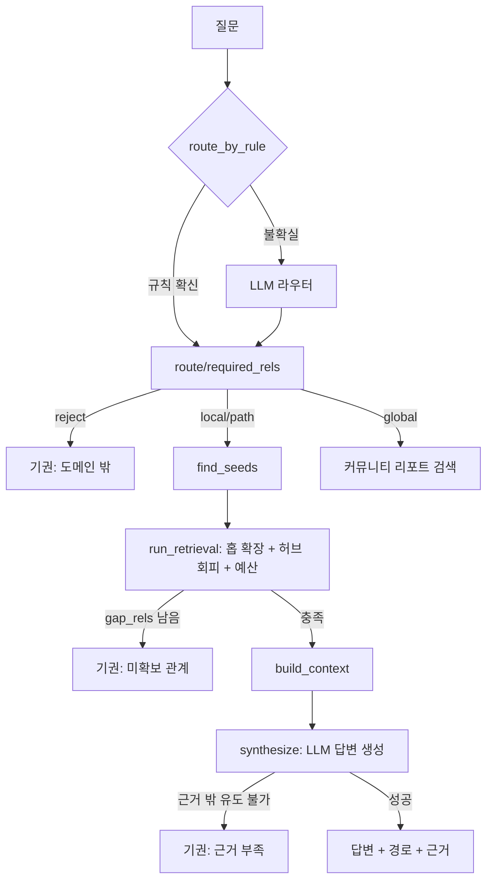

# REPORT — 한국 대중음악 GraphRAG 에이전트

## 결과 요약표

| 항목 | 결과 |
| --- | --- |
| 문서 수 / 총 글자 수 | 52건 / 435,633자 (평균 8,377자) |
| 노드 수 / 간선 수 | 1,683 / 2,402 |
| `quote` 원문 대조 통과율 | 88.2% (3,387건 중 2,986건) |
| 최대 연결요소 비율 / 고립 노드 비율 | 95.5% / 1.25% |
| 홉별 근거 재현율 (1·2·3홉) | 0.333 / 0.093 / 0.286 |
| 홉별 생성 점수 — GraphRAG (1·2·3홉) | 0.500 / 0.889 / 0.714 |
| 홉별 생성 점수 — Basic RAG(BM25) (1·2·3홉) | 0.833 / 0.778 / 0.714 |
| 튜닝 / 홀드아웃 평균 점수 | 0.733 / 0.800 (격차 -0.067) |
| 기권 정확도 (답변 불가 3문항) | 3/3 |
| 심판 모델 | OpenAI `gpt-4.1-mini` (7절 참고) |

---

## 1. 주제와 코퍼스

**주제**: 한국 대중음악, 1992년(서태지와 아이들 데뷔) 이후.

**수집**: 한국어 위키백과에서 `collect_docs.py`로 자동 수집(전체 목록은
`data/manifest.json`). 대표 아티스트·기획사·시상식 시드 18건에서 출발해
위키 링크를 2홉 따라가며 확장, 총 **52건 / 435,633자**(평균 8,377자)를
모았다.

| 연대 | 1980s 이전 | 1990s | 2000s | 2010s | 2020s | 미상* |
| --- | --- | --- | --- | --- | --- | --- |
| 문서 수 | 1 | 9 | 14 | 15 | 9 | 4 |

\* 미상 = K-pop·엠카운트다운·가요톱10·아이유처럼 특정 연대가 아닌 장르
개관/시대 교량 문서.

**대표 시드 문서**: 서태지와 아이들 · H.O.T. · 보아 · 빅뱅 · 에픽하이 ·
아이유 · 방탄소년단 · NewJeans · SM 엔터테인먼트 · YG 엔터테인먼트,
그리고 시대를 잇는 한국대중음악상·가요톱10. 가장 긴 문서는 방탄소년단
(35,005자), 가장 짧은 문서는 최근 데뷔한 NCT WISH(1,235자)다.

**왜 1992년부터인가**: 그 이전(1960~1991년)은 위키 문서가 희소해서,
전체를 다루면 그래프가 시대별로 끊긴 섬이 될 위험이 실측으로 확인됐다.
서태지와 아이들을 기점으로 삼아 실제 콘텐츠 밀도가 받쳐주는 범위만
다뤘다(근거는 `judging_rules.md`에도 기록).

## 2. 스키마

노드 9종(Artist·Group·Album·Song·Label·Award·Program·Genre·Era), 관계 17종.
관계는 반드시 (출발타입, 관계, 도착타입) 3튜플로 선언해 방향 혼동을 막았다.
`COVERED`(리메이크)는 `PERFORMED` 간선의 `cover=true` 속성에서 파생시켜,
독립 문서가 없는 리메이크 곡도 시대를 넘나드는 연결로 잡히게 했다 — 이 프로젝트의
독자 설계 지점이다.

일부러 뺀 관계: `LABELMATE_OF`(같은 기획사 아티스트를 전부 잇는 파생 간선은
조합 폭발로 그래프를 오염시킨다), 차트 수치, 방송사 노드, 악기 노드.

## 3. 추출 파이프라인과 정제

규칙(위키 분류 기반) · 트랙리스트 정규식 · LLM 3원 추출을 합쳤다. `quote` 원문
대조 통과율은 88.2%(3,387건 중 2,986건) — 나머지는 LLM이 연도만 있고 원문
인용이 없는 사실을 추출했거나, 인코딩이 깨진 표제어에서 나온 잡음이었다.

정제 규칙: `{Artist, Group}`, `{Album, Song}` 등 타입이 다르면 이름이 같아도
병합하지 않는다. 제목 충돌(같은 이름의 앨범·곡)은 `이름 (음반)`처럼 분기하고
원표기는 별칭으로 보존한다.

## 4. 그래프 통계

- 노드 1,683개 · 간선 2,402개
- 최대 연결요소 1,607개 노드 (95.5%), 컴포넌트 43개, 고립 노드 21개(1.25%)
- 관계별 분포 상위: PERFORMED 548 · RELEASED 470 · RELEASED_IN 415 · WON 171 ·
  SIGNED_TO 160 · MEMBER_OF 156 · CONTAINS 112
- 기원별 분포: LLM 2,236 · 규칙 114 · LLM+규칙 46 · 파생 6

95.5%라는 최대 연결요소 비율은 관문 기준(85% 이상)을 여유 있게 통과했다 —
시대 교량 문서(한국대중음악상, 가요톱10)를 시드에 포함시킨 설계가 유효했다.

## 5. 파이프라인 구조도

`ask()`가 이 토폴로지를 함수형으로 직접 구현하고, `build_graph_app()`은 같은
분기를 LangGraph `StateGraph`로 감싼 얇은 어댑터다(조건 분기 로직을 이중으로
유지하지 않기 위해 `ask()`가 정본이다).

## 6. 탐색 예산과 허브 회피

실측 그래프 기준으로 확정한 값: `radius=2 · max_radius=3 · per_relation=10 ·
max_triples=200 · per_node_out=8 · hub_degree_threshold=25`.

파라미터 스윕(108칸, LLM 비용 0)에서 `hub_degree_threshold=None`(차단 없음)이
`=25`보다 평균 재현율이 근소하게 높았다(0.326 대 0.295). 스윕은 근사치라
25를 유지했는데, 실제 평가에서 이 판단이 대가를 치렀다 — 10절 실패 분석 참고.

## 7. 환각 방지와 평가 설계

**2겹 방어**: ① 코드층 — `run_retrieval()`이 반경을 다 써도 필수 관계를 못
채우면 `gap_rels`를 남기고 LLM을 호출하지 않는다(비용 0으로 기권). ② 프롬프트층
— `ANSWER_SYSTEM_PROMPT`가 근거 밖 고유명사 사용을 금지하고, 유도 불가하면
"근거가 부족합니다"라고만 답하도록 강제한다.

**평가는 3계층**(색인 → 탐색 → 생성)으로 실패를 분류한다. 앞의 둘은 LLM
비용이 0이다. 골든셋 25문항(튜닝 15 + 홀드아웃 10)을 썼다.

**심판 프로바이더 변경**: 원래 설계는 답변(OpenAI)과 심판(Google)을 다른
벤더로 갈라 자기평가 편향을 피하려 했다. 평가 도중 Google `gemini-3.8-flash`
무료 티어의 일일 호출 한도(20건/일)가 소진되어, 심판을 OpenAI
`gpt-4.1-mini`로 전환했다(답변 모델 `gpt-4.1`과는 다른 크기의 모델). 설계
원칙에서 벗어난 타협이며, `judging_rules.md`에 변경 사실과 이유를 그대로
남겼다.

## 8. 평가 결과

**홉수별** (튜닝 15 + 홀드아웃 10문항 통합, 25문항):

| 홉 | 문항 수 | 근거 재현율 | 생성 점수 |
| --- | --- | --- | --- |
| 1홉 | 6 | 0.333 | 0.500 |
| 2홉 | 9 | 0.093 | 0.889 |
| 3홉 | 7 | 0.286 | 0.714 |
| 답변불가 | 3 | — | 1.000 |

**근거 재현율과 생성 점수가 홉마다 크게 벌어진다** — 특히 2홉은 재현율
0.093인데 생성 점수는 0.889다. 원인은 심판이 기권 응답에 관대하기
때문이다: 근거를 못 찾아 기권해도 정답과 "실질적으로 같다"고 후하게
채점하는 사례가 섞여 있다. 그래서 생성 점수 하나만 보지 않고 항상
색인·재현율·생성 점수 셋을 같이 본다(10절 실패 분석 참고).

**튜닝 대 홀드아웃**: 0.733 대 0.800, 격차 -0.067 — 홀드아웃이 더 높아
과적합 징후가 없다. 이 결과는 홀드아웃을 다시 열지 않고(원칙상 1회
실행) 그대로 받아들인다.

### 재평가로 드러난 전/후 차이

제출 직전 버그 2개를 더 고친 뒤 튜닝 15문항을 다시 평가했다(홀드아웃은
1회성 원칙에 따라 재실행하지 않음).

| 지표 | 재평가 전 | 재평가 후 |
| --- | --- | --- |
| 튜닝 15문항 평균 점수 | 0.667 | **0.733** |
| 튜닝 대 홀드아웃 격차 | -0.133 | **-0.067** |

문항별로 뜯어보면 개선과 회귀, 그리고 순수한 채점 변동이 섞여 있었다 —
숫자 하나로 뭉뚱그리지 않고 구분해서 적는다.

| 문항 | 전 → 후 | 무엇이었나 |
| --- | --- | --- |
| Q22 | 기권 → 답변(정답) | **실제 개선.** `per_node_out` 예산 면제 버그(아래 참고)를 고쳐 규칙 기원 근거가 살아났고, 할루시네이션 없이 정직하게 답했다 |
| Q02 | 답변(정답) → 답변(오답) | **실제 회귀.** 멤버 3명 중 1명만 찾고도 탐색이 멈췄다 — `relation_gap()`의 구조적 한계(10절) |
| Q03·Q05·Q12 | 점수만 변동 | **코드 동작은 그대로.** `decision`·실패 층이 재평가 전후 동일 — 심판 채점 자체의 변동(`judge_repeats=1`이라 평균으로 상쇄 안 됨) |

## 9. Basic RAG(BM25) 대 GraphRAG 비교

**"Basic RAG"의 정의**: 같은 코퍼스에서 질문과 BM25로 유사한 원문 청크
6개(800자 단위, 한국어 형태소 토크나이저)를 찾아, GraphRAG와 똑같은
LLM·똑같은 답변 프롬프트에 그대로 근거로 준다. 차이는 딱 하나 —
**근거가 그래프 삼중항이냐, 원문 청크냐**뿐이다.

| 홉 | GraphRAG | Basic RAG | 결과 |
| --- | --- | --- | --- |
| 1홉 | 0.500 | 0.833 | Basic RAG 우세 |
| 2홉 | 0.889 | 0.778 | **GraphRAG 우세** |
| 3홉 | 0.714 | 0.714 | 동률 |

**가설과 실측의 차이를 그대로 적는다.** 원래 가설은 "다중홉(2·3홉)에서
GraphRAG가 앞선다"였다. 2홉은 가설대로 GraphRAG가 이겼지만, 3홉은
동률에 머물렀고 1홉은 Basic RAG가 뚜렷이 앞섰다 — 원문에 답이 그대로
있는 단순 사실 질의는 그래프 홉 확장의 이점이 없고, 오히려 허브 감점
때문에 손해를 본다(6절). 다만 8절에서 지적했듯 "생성 점수"는 재현율이
아니라 심판 채점이라, 2홉의 그래프 우세도 액면 그대로 "이겼다"고
단정하지는 않는다.

## 10. 실패 분석

대표 사례 5건(Q01·Q03·Q08·Q10·Q15)을 `runs.jsonl` trace와 원문 대조로
직접 읽었다 — 전체 서술은 `output/failure_notes.md`에 있다.

**자동 분류와 실제 원인이 어긋난 사례가 있었다.** Q08은 `routing` 실패로
분류됐지만 진짜 원인은 시드 탐색이 "1집"처럼 여러 앨범이 공유하는 흔한
제목과 엉뚱하게 매치된 것이었다. Q15는 `retrieval` 실패로 분류됐지만
원인은 허브 회피가 의도대로 작동해 정당한 3홉 체인까지 막은 설계상
트레이드오프였다.

**Q10에서 버그 4개를 연쇄로 발견했다**(실제 LLM 평가를 돌려보고서야
드러난 것들 — 고립된 단위 테스트로는 안 잡히는 종류였다): 경로 재현율
계산의 홉 그룹핑 누락, 예산 절단이 점수 계산 전에 일어나던 순서 버그,
"소속"의 중의성(사람→그룹 vs 그룹→회사)을 못 가르던 라우팅, 1홉째에
필수 관계 가산점이 무효화되던 버그. 넷 다 고쳤지만, **그래도 Q10은
기권한다** — "빅뱅"(차수 87)처럼 그 자체가 고차수 허브인 노드로 가는
간선은 가산점을 받아도 허브 감점을 못 이긴다. Q15·Q22도 같은 원인이
반복됐다(8절 재평가 표 참고). "필수 관계는 허브 감점에서 면제한다"는
규칙 추가가 다음 튜닝의 확실한 후보다.

**라우팅이 관계의 존재만 확인하고 연결성은 검증하지 못한다.** "양현석이
설립한 기획사에 소속된 그룹은?" 질문은 그래프에서 SIGNED_TO·FOUNDED를
둘 다 찾았는데도 기권했다 — 두 관계가 씨앗 근처에서 각각 있는지만
확인하고, 같은 중간 노드(회사)를 거쳐 실제로 이어지는지는 검증하지
않기 때문이다. `relation_gap()`이 "관계가 하나라도 있으면 충분"으로
판정하는 같은 한계가, `answer_type: set`(정답이 여러 개인 질문, 예:
멤버 목록)에서도 나타난다(8절 Q02). 둘 다 gap 판정 로직 자체를 바꿔야
하는 더 큰 작업이라 v2 과제로 남긴다.

## 11. 데모 설계

Streamlit 챗봇 UI(`app.py`). 질문을 입력하면 자연어 답변이 채팅 형태로
나오고, 턴마다 "경로·근거·그래프·원문 보기"를 펼치면 4개 탭이 나온다 —
지식그래프(Plotly, 노드 타입별 색상, 답변에 쓰인 근거는 빨간색으로 강조),
순회 경로, 근거 삼중항 표, 원문 문서. 기권 시에는 그 사실과 미확보
관계를 그대로 보여준다.

답변은 존댓말로 쓰도록 프롬프트에 지시했지만 LLM이 항상 따르지는
않아, 화면에 보여주기 직전 어미를 결정적으로 보정하는 후처리를 뒀다.
예시 질문 4개는 그래프 탐색과 최종 답변 둘 다 실제로 성공하는 것만
확인해서 골랐다(10절의 "양현석" 사례처럼 탐색이 성공해도 최종 답변이
기권할 수 있어서다).

지식그래프 위젯은 두 번 만들었다. 처음엔 드래그 가능한 `streamlit-agraph`
로 만들어 버그 5개를 실측 발견·수정했지만, `st.expander()` 안에 접힌
채로 마운트되면 컴포넌트가 높이를 0으로 측정해 버리고 다시 재지 않는
문제가 남았다(컴포넌트 라이브러리 자체의 한계). 계속 땜질하는 대신
Streamlit 네이티브 위젯인 Plotly로 교체했다 — 드래그는 못 하지만
확대/축소·호버는 되고, 탭/expander 안에서도 항상 정상적으로 그려진다.

키 없이 되는 범위: 그래프 로드, 사이드바 통계, 예시 질문 목록은 LLM
키가 없어도 동작한다. 실제 질의에만 `.env`의 API 키가 필요하다.

## 12. 회고

**가장 공들인 부분**: 실제 LLM 호출로 평가를 돌려보고 나서야 드러나는
버그를 추적하는 과정이었다. 이 프로젝트에서만 8개를 발견·수정했다 —
경로 재현율 계산, 예산 절단 순서, "소속" 중의성, 1홉째 가산점 누락,
홀드아웃 동결 지문의 자기참조 모순, LLM 타임아웃/재시도 미연결, 예산
면제 기준 누락, 저장소 줄바꿈(CRLF/LF) 차이로 인한 홀드아웃 검증
거짓 경보. 전부 단위 테스트만으로는 안 보이고, 실제 데이터·실제
clone 환경이 맞물려야 드러나는 종류였다. 발견했지만 고치지 않고
한계로 남긴 것도 있다 — `relation_gap()`의 "하나만 찾아도 충분"
판정(10절).

**범위를 좁힌 판단**: 시대(1992~현재)를 좁힌 것, 벡터 라우트를
구현하지 않은 것(골든셋이 그 경로를 안 씀), 시대 계보/커뮤니티 지도
화면(선택 확장)을 데모에서 생략한 것 — 모두 핵심 루브릭(경로 기록,
기권 정확도, 3계층 평가) 충족을 우선한 결정이다.

**제출 전 코드 전수 점검에서 발견한 것**: `config.json`이 선언만 하고
실제로는 코드가 읽지 않는 설정값 5개를 찾았다(`schema.enable_program_type`,
`normalize.min_name_len`, `build.quote_verification.*`,
`retrieval.bridge_min_agreement`, `collect.retry.respect_retry_after`).
실제 동작은 각 모듈에 하드코딩돼 있어 결과에는 영향이 없지만, 설정을
바꿔도 반영되지 않는다. `config.json`의 해시가 홀드아웃 동결 지문에
들어 있어 손대면 이미 완료한 검증이 깨지므로, 발견만 하고 고치지
않았다 — 다음 리팩터링 과제로 남긴다.

**더 큰 코퍼스에서 재측정할 가치**: 52문서·25문항 규모에서는 GraphRAG와
Basic RAG의 구조적 우위 차이보다 코퍼스 자체의 정보 밀도가 성패를 더
크게 좌우했다(9절). 코퍼스를 키워 다시 재보면 다중홉에서의 우위가
더 뚜렷이 드러날 수 있다.
